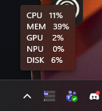
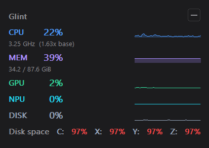
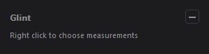

# glint

A tray system monitor for Windows. The tray icon is a live bar chart of CPU,
memory, GPU, NPU and disk, and clicking it opens a small borderless window
with the numbers behind it. Pick which measurements to show from the right
click menu; both the icon and the window follow. The window stays open and on
top until it is minimized, and a hidden window costs almost nothing.



Five strips, top to bottom: CPU, memory, GPU, NPU, disk activity. 
Each fills to its current percentage and turns amber at 80% and red at 95%. Hover for the numbers.



## Build and run

```
cargo build --release
target\release\glint.exe
```

The release binary is about 195 KB. Private memory stays near 6.2 MB, and a
hidden window costs between 0.05% and 0.4% of one core depending on how much
the readings are moving.

The window opens in the lower right corner, clear of the taskbar.

| Action | Result |
|--------|--------|
| Watch the tray icon | One bar per measurement, filled to the current reading |
| Left click the tray icon | Show the window, or hide it when it is open |
| Right click the tray icon | Choose measurements, Hide, Start with Windows, Reset position, tip link, Exit |
| Minimize button | Hide the window; hover for a tooltip |
| Drag the header | Move the window; the position is remembered |

The right click menu carries a check mark per measurement — CPU, Memory, GPU,
NPU, Disk activity, Disk space. GPU and NPU appear only when the hardware
does. The window is exactly as large as the measurements it draws, so hiding
rows makes it smaller, the tray icon loses the matching strip, and the choice
survives a restart.

Disk space has no strip in the icon, because it is per drive and has no single
value a bar could show. It appears in the window as one line of percentages.

Turn everything off and the window says how to get a row back:



There is no taskbar button and no title bar, so **Exit** in the right click
menu is how to quit.

Settings live in `%APPDATA%\glint\config.json`.

The menu's last line before **Exit** links to
[KUAF](https://www.kuaf.com/donate), the maintainer's local NPR member
station. It is a nudge, not a toll — glint is free and the link is the only
thing asking for anything.

## Probe binaries

| Command | What it answers |
|---------|-----------------|
| `cargo run --release --bin spike` | Adapter discovery, PDH cost, CPU base clock |
| `cargo run --release --bin spike -- --watch` | A 30 s live table, to compare with Task Manager |
| `cargo run --release --bin wildcard` | Whether a PDH wildcard counter re-expands |
| `cargo run --release --bin sample` | The sampler, as console output |
| `cargo run --release --bin cpucheck` | How `% Processor Utility` reacts to clock boost |

## Tests

```
cargo test
```

Two requirements earn automated tests: `GLINT-LUID-PARSE` and `GLINT-CONFIG-PARSE`.
Every other requirement carries a manual procedure in the spec.

## Spec

`specs/glint/spec.md` is authoritative. It holds the requirements, the
manual procedures, and the design notes that explain why the app uses WDDM
rather than DXCore, GDI rather than Direct2D, and a live tray icon rather than
a Windows 11 Widgets Board provider.

## Requirements

No external crates beyond `windows`. Windows 10 or later. Rust stable, MSVC
target. The NPU row needs WDDM 2.9 for `D3DKMTEnumAdapters3`; without it the
row is simply absent.
